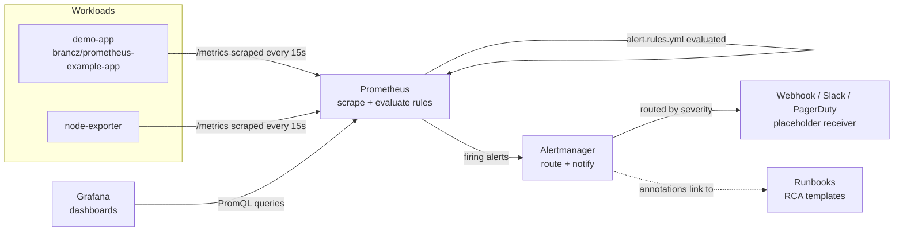

# Kubernetes Observability & Alerting Stack

**Stop finding out about outages from your customers.** A ready-to-run monitoring, dashboarding, and alerting stack that watches your services and pages you before they do.

## Problem & Solution

Most small and mid-sized teams running production workloads - especially on Kubernetes - have no proactive monitoring. Nobody sees an error rate climbing or a pod crash-looping until a customer complains. When something does break, there's no structured process to figure out what happened, so the same incidents repeat.

This project is a self-contained observability stack that:

- **Collects metrics** from your services with Prometheus.
- **Visualizes them** in pre-built Grafana dashboards (no manual setup).
- **Detects problems automatically** with SLA-style alert rules (error rate, latency, target down, restart loops).
- **Routes alerts** to the right place via Alertmanager, ready to plug into Slack/PagerDuty.
- **Gives on-call engineers a starting point** with structured RCA runbooks instead of a blank page during an incident.
- **Automates routine maintenance** with a cron/CronJob-style health-check-and-remediate script, the same pattern used to catch and self-heal issues before they become incidents.

## Features

- Docker Compose stack: Prometheus, Grafana, Alertmanager, node-exporter, and a public Prometheus demo app.
- Dashboards-as-code: Grafana datasource and dashboards are auto-provisioned, no manual UI clicking.
- SLA-style alert rules: `HighErrorRate`, `HighRequestLatency`, `TargetDown`, `InstanceRestartLoop`, each with `for:` durations, severity labels, and a linked runbook.
- Alertmanager routing by severity, with a placeholder webhook receiver (safe to commit, easy to swap for a real Slack/PagerDuty integration).
- Two structured RCA runbook templates (Symptom / Likely Causes / Diagnostic Steps / Remediation / Escalation).
- A real, shellcheck-clean remediation script demonstrating the cron-job automated-maintenance pattern, plus an equivalent Kubernetes CronJob manifest.
- An automated end-to-end smoke test that brings the whole stack up, verifies every service is healthy and that Prometheus is actually scraping the demo app, then tears it down.
- GitHub Actions CI: lints all YAML and shell, then runs the smoke test against a real Docker stack on the runner.

## Tech Stack


## Screenshots / Demo

Placeholders live in [`docs/screenshots/`](docs/screenshots/). Run the stack locally with the commands below, open Grafana, and drop a real screenshot of the "Service Health" dashboard into that folder (see `docs/screenshots/README.md`).

## Architecture



## Local Setup

**Prerequisites:** Docker and Docker Compose v2 (`docker compose version`).

```bash
git clone <this-repo>
cd k8s-observability-stack
cp .env.example .env   # optional: customize ports/password first
docker compose up -d
```

Once running:

| Service      | URL                          | Notes                                 |
|--------------|-------------------------------|----------------------------------------|
| Prometheus   | http://localhost:9090         | Targets: http://localhost:9090/targets |
| Grafana      | http://localhost:3000         | Login: `admin` / `changeme` (or your `.env` value) |
| Alertmanager | http://localhost:9093         | Shows routed/firing alerts             |
| demo-app     | http://localhost:8080/metrics | Raw Prometheus metrics endpoint        |

Tear down with `docker compose down -v` (the `-v` also removes the named volumes).

## Environment Variables

Configured via `.env` (copy from `.env.example`):

| Variable                  | Default   | Description                                 |
|---------------------------|-----------|----------------------------------------------|
| `GRAFANA_ADMIN_PASSWORD`  | `changeme`| Grafana admin password. Change before any shared use. |
| `PROMETHEUS_RETENTION`    | `15d`     | How long Prometheus retains time-series data. |
| `GRAFANA_PORT`            | `3000`    | Host port for the Grafana UI.                |
| `PROMETHEUS_PORT`         | `9090`    | Host port for the Prometheus UI/API.         |
| `ALERTMANAGER_PORT`       | `9093`    | Host port for the Alertmanager UI/API.       |
| `DEMO_APP_PORT`           | `8080`    | Host port for the demo app's `/metrics`.     |
| `NODE_EXPORTER_PORT`      | `9100`    | Host port for node-exporter's `/metrics`.    |

## Running Tests

An end-to-end smoke test brings up the real stack, checks every service's health endpoint, confirms Prometheus is actually scraping the demo app (`up == 1`), then tears everything down:

```bash
chmod +x tests/smoke-test.sh
./tests/smoke-test.sh
```

This is also run automatically in CI on every push/PR (see `.github/workflows/ci.yml`).

## Deployment Notes

This Docker Compose stack is intended for **local development and client demos** - it proves the monitoring/alerting/dashboarding pattern works end-to-end. For a **real production Kubernetes deployment**, the standard, battle-tested path is the [`kube-prometheus-stack`](https://github.com/prometheus-community/helm-charts/tree/main/charts/kube-prometheus-stack) Helm chart, which deploys Prometheus, Alertmanager, Grafana, and the Prometheus Operator (with CRDs for `ServiceMonitor`/`PrometheusRule`) directly into your cluster. The alert rules, dashboard JSON, and runbooks in this repo translate directly into `PrometheusRule` and Grafana dashboard ConfigMaps in that setup.

## What I'd Build Next

- **Long-term metrics storage**: Thanos or Grafana Mimir for multi-cluster, long-retention queries beyond Prometheus's local TSDB.
- **Real alert routing**: wire Alertmanager's placeholder webhook to a real Slack channel and/or PagerDuty routing key (via `.env`/Secrets, never hardcoded).
- **Production deployment**: roll this out as `kube-prometheus-stack` via Helm, with `ServiceMonitor`/`PrometheusRule` CRDs per-service instead of static scrape configs.
- **Log correlation**: pair these metrics with centralized logging (Splunk/Graylog) so RCA runbooks can pivot straight from an alert to the relevant logs.
- **SLO dashboards**: formal error-budget burn-rate alerts on top of the raw `HighErrorRate`/`HighRequestLatency` rules here.

## Contact

Built by **Rakesh Chaudhari** - DevOps engineer specializing in Kubernetes observability, alerting, and incident response.

- LinkedIn: https://www.linkedin.com/in/crak
- Email: C.rakesh31196@gmail.com
